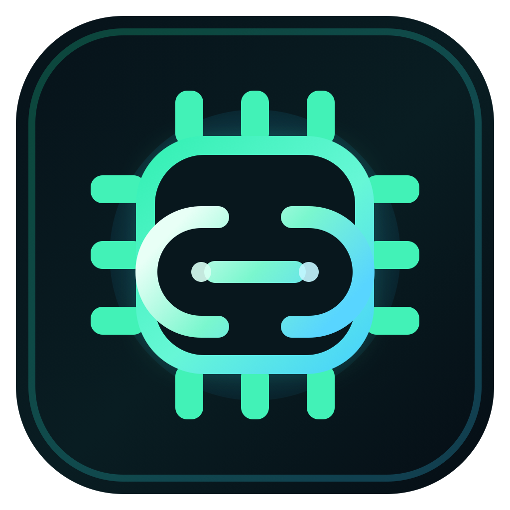

<p align="center">
  
</p>

<h1 align="center">Connect AI v2 (P-Reinforce)</h1>

<p align="center">
  <strong>100% Local · 100% Offline · Autonomous Knowledge Engine</strong><br/>
  VS Code / Cursor 확장 프로그램으로, 당신의 낡은 IDE를 최상위 에이전트 대학(A.U)의 심장으로 진화시킵니다.
</p>

<p align="center">
  
  
  
  
</p>

---

## 🌟 Overview: The P-Reinforce Architecture

Connect AI v2.2.22는 단순한 코딩 에이전트를 넘어섭니다. **P-Reinforce 아키텍처**를 기반으로 설계된 이 에이전트는 사용자의 모든 정보와 지시를 받아들여 **스스로 의미를 분석하고, 폴더를 생성하고, 마크다운 위키 파일로 정리하여 클라우드에 자동 백업**하는 자율 지식 정원사(Autonomous Gardener)입니다.

---

## ⚡ Core Features

### 1. 🧠 Agent University (A.U) 완벽 연동
Agent University 웹 플랫폼과 실시간으로 통신합니다. 
웹에서 버튼 한 번 누르는 즉시, 로컬 VS Code의 `4825` 포트를 통해 프리미엄 브레인 팩(Premium Brain Pack) 지식이 로컬 인공지능 뇌(`~/.connect-ai-brain`)에 자동 주입되어 신경망을 확장합니다.

### 2. 📂 자율 지식 구조화 (Zero-Interaction Styling)
유저가 던져주는 원시 데이터(Raw Data)를 에이전트가 스스로 판단해 `10_Wiki`, `00_Raw`, `🚀 Skills` 와 같은 완벽한 P-Reinforce 템플릿 규격의 Markdown 파일로 분할-조립하여 저장합니다.

### 3. ☁️ 클라우드 동기화 (Auto-Git Sync 100%)
로컬 PC에서 파일 생성이 일어나는 순간, 에이전트가 스스로 GitHub 저장소에 `git add`, `commit`, `push`를 수행합니다. 
마스터는 이제 지루한 푸시 커맨드를 입력할 필요가 없습니다.

### 4. 🔗 설치형 모델 자동 감지 (Dynamic Model Detection)
Ollama 또는 LM Studio에 설치된 모델을 내부 API(`v1/models`)를 호출하여 자동 감지하고, UI의 스위치 보드(드롭다운)에 연결합니다. 어떤 모델을 쓸지 번거롭게 입력하지 마십시오.

---

## ⚒️ Agent Capabilities (에이전트 권한)

로컬 머신의 파일 시스템과 터미널에 대한 통제권을 인공지능에게 부여합니다. (100% 안전한 권한 승인 기반)

| Action | Description |
|:--|:--|
| **📄 Create Files** | 새로운 파일과 폴더를 생성합니다 |
| **✏️ Edit Files** | 기존 파일 내의 코드를 수정합니다 |
| **🗑️ Delete Files** | 불필요한 파일을 즉각 파쇄합니다 |
| **📖 Read Files** | 마스터의 프로젝트 파일을 읽어 맥락을 파악합니다 |
| **📂 Browse Directories** | 디렉토리 구조를 분석합니다 |
| **🖥️ Run Commands** | `npm run build`, `git push` 등 터미널 명령을 수행합니다 |

---

## 📥 Installation (설치 방법)

### A.U 멤버십 유저 (Recommended)
1. 상단 탭의 [Releases](https://github.com/wonseokjung/connect-ai/releases) 메뉴로 진입.
2. 최신 `connect-ai-lab-2.2.22.vsix` 파일을 다운로드.
3. VS Code 에서 `Cmd+Shift+P` → **Extensions: Install from VSIX** → 다운받은 파일 선택

### 개발자 빌드 (Build from Source)
```bash
git clone https://github.com/wonseokjung/connect-ai.git
cd connect-ai
npm install
npm run compile
npm run package:vsix -- --notes "이번 VSIX에 포함된 주요 변경사항을 자세히 적습니다"
```

---

## 📦 VSIX Release Rule (필수)

앞으로 VSIX 파일을 빌드할 때마다 `npm run package:vsix` 스크립트가 아래 규칙을 강제합니다.

1. **버전 자동 증가:** VSIX 빌드 시 `package.json`과 `package-lock.json`의 패치 버전을 항상 `0.0.1`씩 올립니다. 예: `2.2.17` → `2.2.18`.
2. **README 기록 필수:** `--notes`, `--notes-file`, 또는 `RELEASE_NOTES`가 없으면 빌드를 중단합니다.
3. **릴리스 노트 자동 삽입:** 전달된 변경 내용을 `Release Notes` 최상단에 새 버전 항목으로 기록합니다.
4. **문서 버전 동기화:** README의 버전 배지, Overview 버전, 설치용 VSIX 파일명을 새 버전에 맞춰 갱신합니다.
5. **빌드 순서:** 스크립트가 먼저 `npm run compile`로 사전 검증한 뒤 버전을 올리고, 로컬 `@vscode/vsce`로 VSIX를 생성합니다.
6. **저장 위치:** 생성된 VSIX는 항상 `release/` 폴더에 저장합니다. 예: `release/connect-ai-lab-2.2.18.vsix`.
7. **파일명 확인:** 생성된 파일명은 버전과 일치해야 합니다. 예: `connect-ai-lab-2.2.18.vsix`.
8. **기존 변경 보호:** 작업 중인 다른 파일 변경사항이 있으면 되돌리지 않고, 릴리스에 필요한 버전/문서/빌드 산출물만 갱신합니다.

권장 명령:

```bash
npm run package:vsix -- --notes "에디터 영역 채팅 패널 전환; README 릴리스 규칙 자동화"
```

여러 줄로 자세히 기록해야 할 때는 아래처럼 사용합니다.

```bash
RELEASE_NOTES=$'- 에디터 영역 WebviewPanel로 채팅 위치를 이동했습니다.\n- VSIX 빌드 시 README 릴리스 노트 작성을 강제합니다.' npm run package:vsix
```

또는 별도 파일을 사용할 수 있습니다.

```bash
npm run package:vsix -- --notes-file release-notes.md
```

`scripts/package-vsix.mjs`는 패치 버전 증가, `package-lock.json` 동기화, README 배지/설치 안내/릴리스 노트 갱신, `release/` 폴더 VSIX 생성을 한 번에 수행합니다. 릴리스 노트가 비어 있거나 너무 짧으면 빌드하지 않습니다.
필요하면 `Release Notes` 아래 `### 다음 VSIX 예정` 섹션에 미리 변경사항을 적어둘 수 있으며, 패키징 시 이 항목은 새 버전 릴리스 노트로 합쳐진 뒤 제거됩니다.

패키징 경고를 줄이기 위해 `npx vsce package` 대신 로컬 devDependency인 `@vscode/vsce` 기반의 `npm run package:vsix`를 사용합니다. 또한 `activationEvents`는 `*`를 쓰지 않고 실제 뷰와 명령 진입점만 명시합니다.

---

## 📝 Release Notes

### v2.2.22

- VSIX 빌드 버전을 `2.2.21`에서 `2.2.22`로 올렸습니다.
- Connect AI 아이콘을 로컬 LLM 연결 느낌의 칩 + 링크 형태로 개편하고, 툴바용 단색 아이콘과 패키지용 컬러 아이콘을 각각 최적화했습니다
- 릴리스 스크립트가 `release/connect-ai-lab-2.2.22.vsix` 패키지를 생성합니다.

### v2.2.21

- VSIX 빌드 버전을 `2.2.20`에서 `2.2.21`로 올렸습니다.
- VSIX build for version 2.2.21
- Action executor and project cleanup
- 릴리스 스크립트가 `release/connect-ai-lab-2.2.21.vsix` 패키지를 생성합니다.

### v2.2.20

- VSIX 빌드 버전을 `2.2.19`에서 `2.2.20`로 올렸습니다.
- VSIX 빌드 산출물이 프로젝트 루트가 아니라 `release/` 폴더에 저장되도록 `scripts/package-vsix.mjs`의 `vsce package --out` 경로를 변경했습니다.
- 패키징 스캔에 기존 릴리스 산출물이 섞이지 않도록 `.vscodeignore`에 `release/**` 제외 규칙을 추가했습니다.
- README의 VSIX 릴리스 규칙에 `release/connect-ai-lab-x.y.z.vsix` 저장 위치를 명시했습니다.
- 상단 editor title 아이콘에서 Connect AI를 열도록 추가
- Connect AI webview를 오른쪽 secondary sidebar에 등록
- VSIX에 secondary sidebar 아이콘 SVG 포함
- 릴리스 스크립트가 `release/connect-ai-lab-2.2.20.vsix` 패키지를 생성합니다.

### v2.2.19

- VSIX 빌드 버전을 `2.2.18`에서 `2.2.19`로 올렸습니다.
- VSIX 패키지에서 빌드 전용 scripts 폴더를 제외
- v2.2.18 릴리스 노트의 중복 문구를 정리
- 릴리스 스크립트가 `connect-ai-lab-2.2.19.vsix` 패키지를 생성합니다.

### v2.2.18

- VSIX 빌드 버전을 `2.2.17`에서 `2.2.18`로 올렸습니다.
- 채팅 UI를 Activity Bar/Secondary Side Bar 뷰에서 에디터 영역 `WebviewPanel`로 이동해 Codex처럼 코드 편집기 옆에서 열리도록 변경했습니다.
- `Connect AI: Open Chat`, `Cmd+L` 포커스, 선택 코드 설명 명령이 채팅 패널을 자동으로 열고 재사용하도록 정리했습니다.
- VSIX 빌드 시 패치 버전을 `0.0.1`씩 자동 증가시키고, README 릴리스 노트 입력을 강제하는 `scripts/package-vsix.mjs`를 추가했습니다.
- `package:vsix`가 더 이상 단순 `vsce package`를 직접 호출하지 않고, 컴파일 사전 검증과 문서 동기화를 거친 뒤 패키징하도록 변경했습니다.
- 릴리스 스크립트가 `connect-ai-lab-2.2.18.vsix` 패키지를 생성합니다.

### v2.2.17

- VSIX 빌드 버전을 `2.2.16`에서 `2.2.17`로 올렸습니다.
- `src/extension.ts`를 읽기 쉽고 유지보수하기 쉬운 구조로 리팩터링했습니다.
- AI 엔진 엔드포인트 판별, 스트리밍 파싱, 브릿지 서버 라우팅, 프롬프트 컨텍스트 구성을 헬퍼 함수로 분리했습니다.
- 첫 실행 자동 감지에서 실제 설정 키인 `connectAiLab.ollamaUrl`이 갱신되도록 정리했습니다.
- `connect-ai-lab-2.2.17.vsix` 패키지를 생성했습니다.

### v2.2.16

- VSIX 빌드 버전을 `2.2.15`에서 `2.2.16`으로 올렸습니다.
- 채팅 웹뷰의 마크다운 렌더링을 `markdown-it` 기반으로 교체해 제목, 구분선, 리스트, 표, 인용문, 취소선, 링크, 코드블록 렌더링을 개선했습니다.
- VSIX 패키지에 `markdown-it` 런타임 파일이 포함되도록 `.vscodeignore` 허용 목록을 갱신했습니다.
- `connect-ai-lab-2.2.16.vsix` 패키지를 생성했습니다.

### v2.2.15

- VSIX 빌드 버전을 `2.2.14`에서 `2.2.15`로 올렸습니다.
- 패키징 시 `'*' activation` 성능 경고가 나오지 않도록 `activationEvents`를 실제 진입점 기준으로 구체화했습니다.
- 구버전 `vsce` 패키지 deprecation 경고를 피하기 위해 `@vscode/vsce`를 devDependency로 추가하고 `npm run package:vsix` 스크립트를 도입했습니다.
- README의 개발자 빌드 절차와 VSIX 릴리스 규칙을 새 패키징 명령 기준으로 갱신했습니다.

### v2.2.14

- VSIX 빌드 버전을 `2.2.13`에서 `2.2.14`로 올렸습니다.
- `connect-ai-lab-2.2.14.vsix` 패키지를 생성했습니다.
- 첨부 이미지 전송 시 채팅 말풍선 안에 실제 이미지 썸네일 카드가 표시되도록 개선했습니다.
- 텍스트/일반 파일 첨부는 별도 파일 카드로 표시되도록 정리했습니다.
- 대화 복원 시에도 첨부 이미지와 파일 카드가 다시 표시되도록 저장 구조에 첨부 메타데이터를 추가했습니다.
- Vision 모델로 이미지를 보낼 때 `image/png`로 고정하지 않고 실제 MIME 타입을 사용하도록 개선했습니다.

---

## ⚙️ Engine Setup (엔진 설정 방법)

### ✅ LM Studio (Apple Silicon, Windows) - 권장
1. [lmstudio.ai](https://lmstudio.ai/) 에서 설치
2. Gemma 3, Llama 3 또는 Qwen Coder 등 원하는 모델 로드
3. **Developer 탭(좌측 `<>` 메뉴)** 진입 후 **Start Server** 클릭
4. Connect AI의 ⚙️ 채팅방 설정에서 엔진을 "LM Studio"로 선택 (자동 모델 인덱싱 완료)

### ✅ Ollama (Mac, Linux)
```bash
brew install ollama
ollama pull gemma3   # 원하는 모델 풀링
```
Connect AI에서 설정만 "Ollama"로 바꿔주시면 끝납니다.

---

## 🔒 Privacy (완벽한 보안)

- **Zero Cloud API:** 당신의 코드는 외부 클라우드 통신망을 타지 않습니다.
- **Zero Telemetry:** 모든 연산력은 100% Local Inference 환경에서 이루어집니다.
- 기업 보안 등급에 준하는 극강의 밀폐형 로컬 지식망 생성을 보장합니다.

---

<p align="center">
  <strong>Built for Antigravity & Agent University</strong><br/>
  Designed by <a href="https://github.com/wonseokjung">Jay</a> × Connect AI Architect
</p>
